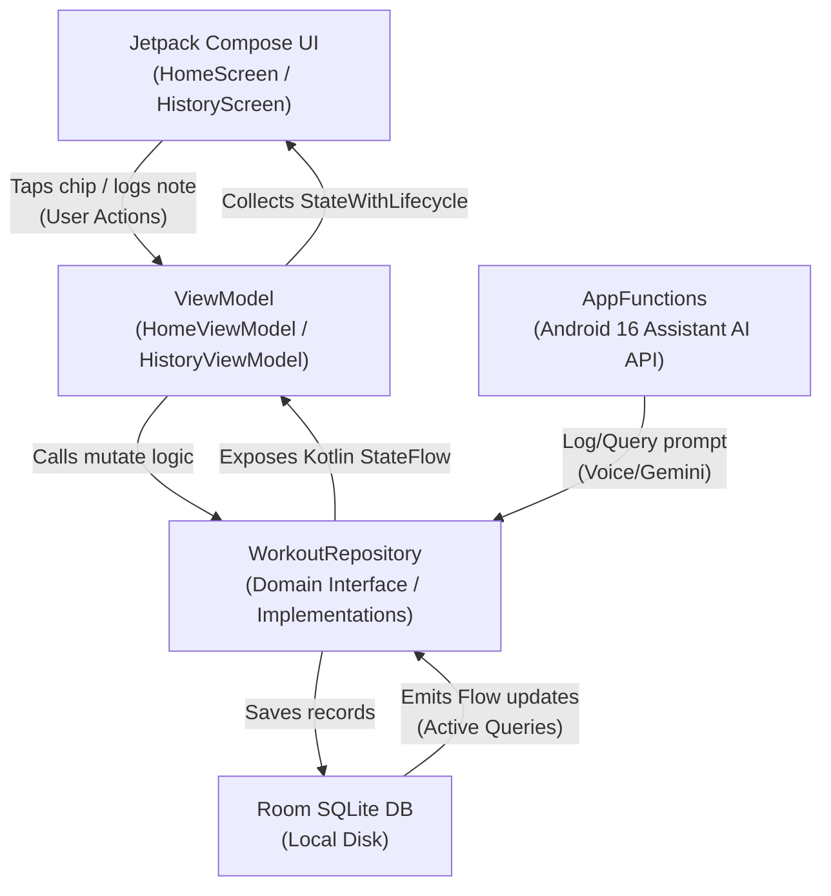

# Technical Architecture Guide

This document maps out the system architecture, database layout, data flows, and automated testing interface for FlinkLog. AI agents and developers must read this guide to understand the codebase without parsing all source files.

---

## 🏗️ 1. Package Structure Map
```text
app/src/main/java/com/ayogeshwaran/workoutlogger/
├── MainActivity.kt               # Entry Activity (Jetpack Compose host)
├── WorkoutLoggerApplication.kt   # App Context and AppFunctions config provider
├── appfunctions/                 # Android 16 AppFunctions exposed interfaces
│   └── WorkoutAppFunctions.kt    # Logic mapping assistant prompts to repository
├── data/                         # SQLite Room Database implementation
│   ├── local/
│   │   ├── WorkoutDao.kt         # Database Access Object
│   │   └── WorkoutDatabase.kt    # SQLite Room Database Definition
│   │   └── entity/               # Room Table Definitions (Entry, Custom Types)
│   └── repository/
│       └── WorkoutRepositoryImpl.kt # Data source repository implementation
├── di/                           # Manual dependency injection containers
│   └── AppContainer.kt           # Singleton database & repository instances
├── domain/                       # Core business rules & entities (pure Kotlin)
│   ├── model/                    # Domain Entity definitions
│   └── repository/               # Repository interfaces
└── presentation/                 # Jetpack Compose UI Views & ViewModels
    ├── about/                    # About FlinkLog Screen
    ├── components/               # Custom UI Cards, Dialogs, & Canvas graphics
    ├── history/                  # Calendar monthly/weekly lists & view models
    ├── home/                     # Log entry boards & view models
    ├── navigation/               # Bottom bar navigations
    └── theme/                    # Material You dynamic design system
```

---

## 🔄 2. Data Flow Architecture
FlinkLog follows a clean Unidirectional Data Flow (UDF) lifecycle:



---

## 🧪 3. Running Automated Test Suites

Future developers and AI agents can programmatically run verification test suites to evaluate the safety of their changes.

### 3.1 Run JVM Unit Tests (Fast Local Verification)
Executes ViewModel state transitions, habit logic, and AppFunctions mock database routing:
```bash
./gradlew testDebugUnitTest
```

### 3.2 Run Static Lint Scans
Executes Compose rules, resource lookups, layout checking, and XML formats:
```bash
./gradlew lintDebug
```

### 3.3 Run Device/Emulator Instrumentation Tests
Executes database migrations and context configurations:
```bash
./gradlew connectedDebugAndroidTest
```

### 3.4 Combined Quality Suite
Use this single command line to verify both compilation and lint checks before committing code changes:
```bash
./gradlew compileDebugKotlin lintDebug testDebugUnitTest
```
